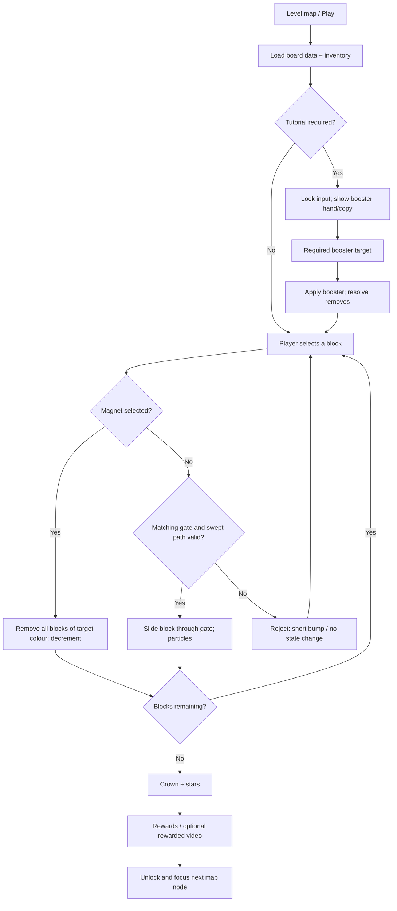
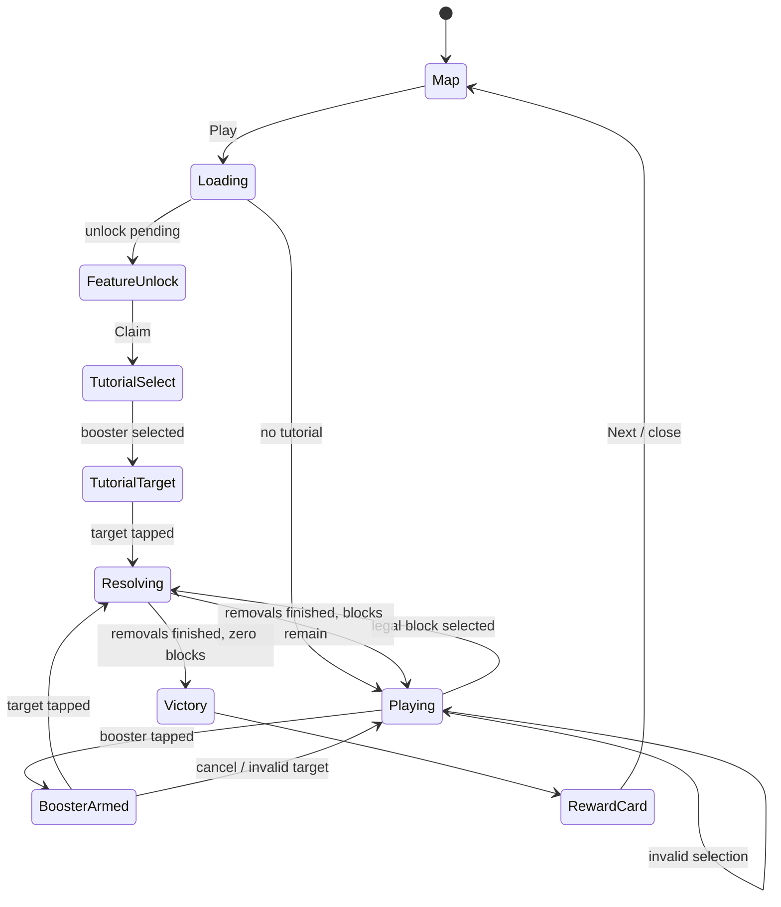

# BBS1 gameplay reverse engineering

## Evidence and scope

Primary evidence: `C:\Users\Basweshwar\Downloads\BBS1.mp4`, decoded at 30 fps, 536 x 874, duration **234.07 s**. The recording shows Levels 11, 12, and 13. This document describes observed behaviour; items tagged **inferred** are implementation conclusions, not facts that can be proven from a screen recording. No original artwork, name, characters, or branding should be reused.

The recording has no visible touch indicators. A desktop pointer appears, so exact tap/drag gesture and audio are not verifiable. The on-screen tutorial confirms that the magnet uses a tap on a block.

## One-sentence product definition

A portrait, single-screen spatial-clear puzzle: remove chunky coloured blocks by sending them through matching perimeter exits while keeping each exit path clear; use limited boosters to recover from congestion.

## Complete observed timeline

Each range covers every second in the source. Repeated one-second views within an interval show the same board with one or more blocks being cleared; there are no cuts hidden by the grouping.

| Time | What is seen / meaningful state change | Player expectation and feedback |
|---|---|---|
| 0–9 | Level 11 board is already active. An 8 x 8-looking dark tiled board contains cyan, blue, green, pink, red and purple brick pieces. Colour-coded exit strips with white arrows occupy the rim. Some pieces carry large white direction arrows. Two central `FREE` video tiles sit in otherwise unusable-looking central spaces. Bottom booster tray: red plunger (count 1), magnet. | Learn that pieces must leave through the coloured edge apertures. Tap/select a legal piece (exact gesture is not visible). The board begins clearing immediately in the recording; a selected block translates cleanly toward an exit. |
| 10–19 | Level 11 solution continues. Occupancy decreases in the top/right and lower areas, revealing the dark square grid. | Route unblocked pieces first. Exit strips and directional arrows are the affordance; no text tutorial appears. |
| 20–29 | More Level 11 pieces move/vanish, especially the upper and right clusters. Board remains fixed; cursor moves over playfield. | Continue selecting legal exits. No lives, timer, score, or explicit failure feedback appears. |
| 30–39 | The board is materially more open. Remaining pieces form separated left, lower, and right clusters. | Re-evaluate available straight paths after each removal. |
| 40–49 | Continued single-piece departures. The central `FREE` tiles remain fixed. | Preserve exit lanes; use a different colour/edge when a lane is blocked. |
| 50–59 | Level 11 is close to solved, with several large pieces remaining around bottom/left/right. | Chain clears; the playfield gives strong progress feedback by exposing empty tiles. |
| 60–64 | Final Level 11 removals begin; blue/cyan pieces visibly depart with small coloured square/confetti particles near the destination rim. | A successful move produces a brief whoosh/pop opportunity and particle burst. |
| 65–69 | A larger clear sequence rapidly leaves only a few pieces. The board frame stays in place. | The pace accelerates because fewer blocking dependencies remain. |
| 70–79 | More blocks slide to their matching rim exit and disappear; cyan/blue particle bursts are visible at the top or side gates. | The visual rule is reinforced: matching gate is the destination, not simply any open board edge. |
| 80–89 | Sparse endgame. Pink, green and cyan pieces remain; each clear exposes a broad empty area. | Endgame is intentionally easy/readable, delivering anticipation of completion. |
| 90–99 | Last clusters clear. Particle bursts occur at side/bottom gates. | The final legal path is obvious rather than punitive. |
| 100–108 | Only a few red/purple/pink pieces remain, then disappear in quick succession. The screen is almost empty except `FREE` tiles and frame. | Completion condition is effectively `remainingBlocks == 0`; fixed ad tiles do not count as blocks. |
| 109–118 | Final Level 11 piece exits; a crown-and-stars `Nice Job!` overlay appears, followed by a completion panel. | Input is temporarily gated while the celebration plays. |
| 119–120 | `LEVEL 11 COMPLETED!` card settles: coin reward `+5`, piggy bank `+100`, green `NEXT`, purple video-reward `+100`, close X, and `NEW FEATURE` progress bar at 61%. Confetti falls. | Next is the primary CTA; rewarded-video alternative is secondary. |
| 121–122 | Map screen scrolls/centres on completed node 11 and unlocks 12. Left rail has piggy progress, remove ads, timed offer; right rail shows future collectible silhouettes; home tab is selected. | The level button becomes `PLAY LEVEL 12`; reward coin flies/appears near the map. |
| 123–125 | Full-screen `Magnet UNLOCKED!` modal appears over dimmed Level 12 board, with a glowing red-blue magnet and then explanatory copy: `Removes all blocks of the selected color!` A green `CLAIM` button appears. | Claim compulsory/new feature. Animation uses warm radial glow and orbiting stars. |
| 126–127 | The modal dismisses into a dimmed focus tutorial. The magnet in the bottom tray is enlarged/haloed, count 2, with a white hand pointing at it. | First tap selects magnet booster. Other input should be blocked. |
| 128 | Tutorial banner: `Magnet — Tap a block to clear all blocks of same color!`; hand points at a large yellow block. | Tap a target-colour block; this is the only explicitly confirmed input mechanic. |
| 129–130 | Magnet animates upward with purple electric arcs; every yellow piece is removed simultaneously. The board brightens back to normal. | Booster consumption decrements from 2 to 1. Feedback should make the global colour match unmistakable. |
| 131–139 | Level 12 normal play. Cyan, red, green, purple blocks progressively exit through matching coloured rim gates. | Clear with ordinary exits after the tutorial-created space. |
| 140–149 | Mid-level: central/right pieces and then side pieces are removed; a cyan exit effect appears at about 143 s. | Board recomputes legal moves after each animation. |
| 150–155 | Final Level 12 blocks are cleared, with a green departure/particle burst near the top/left rim. | Again, no loss state is shown; solve loop ends in an empty board. |
| 156–158 | Crown/star `Nice Job!`, then `LEVEL 12 COMPLETED!` rewards. New-feature meter reads 76%. | Same reward card pattern reinforces mastery and provides ad choice. |
| 159–160 | Map advances to 13. A purple `HARD LEVEL` tag is stamped over the green Play button. | Tapping Play starts a special-difficulty presentation. |
| 161–162 | Purple smoky `HARD LEVEL` interstitial: angry purple block character with flame, large yellow title, dimmed Level 13 board behind. | A short non-interactive tension beat prepares player for denser dependencies. |
| 163–169 | Level 13 begins on a visually denser 6 x 6-looking grid. Top gates red/cyan/blue, side gates green, bottom purple; many pieces begin packed. Booster tray has plunger 1 and magnet 1. | Plan ordering more carefully; matching exits remain visible at the perimeter. |
| 170–179 | Several top/side pieces clear. Board complexity decreases but groups still block each other. | Target blocks whose removal opens the most lanes; avoid assuming colour alone makes a move legal. |
| 180–189 | Mid-game dense-to-open transition. Blocks depart in sequence from top and side gates; cyan/blue particle bursts are visible around 182–184 s. | Immediate removal feedback supports serial puzzle reasoning. |
| 190–199 | Remaining pieces form a lower/right cluster and smaller left/top pieces. More matching-gate departures occur. | The difficulty peak is front-loaded; progress becomes easier to parse after a few clears. |
| 200–209 | Large clearing cascade; board becomes mostly empty, leaving red, green, purple pieces. | Successful clears should lock input per piece animation to prevent race conditions. |
| 210–219 | Endgame: individual remaining pieces clear to side/bottom/top exits. | Keep victory delayed until the last removal animation resolves. |
| 220–229 | Last purple/red pieces clear; coloured square particle bursts at bottom/top gates. Empty board with two `FREE` tiles remains. | `remainingBlocks == 0` transitions to win celebration. |
| 230–234 | `Nice Job!` then `LEVEL 13 COMPLETED!` panel, `+5` coins, `+100` piggy, `NEXT`, video `+100`, 91% feature meter. Map advances and presents Level 14 Play. | End of recording. In a playable ad, this point should be replaced/augmented by an install CTA. |

## Game design document

### Core loop

1. Read coloured pieces, their occupied cells, and coloured perimeter gates.
2. Choose a block whose route to its matching exit is legal.
3. Trigger its departure; the block slides outward and is removed.
4. The empty cells unlock new routes; repeat until no removable blocks remain.
5. If the intended puzzle is congested, use a limited plunger or magnet. Win, celebrate, unlock the next board.

### Board, collision and movement rules

* A board is a rectangular cell grid; evidence suggests Level 11 is approximately 8x8 and Levels 12–13 approximately 6-wide with different cell scale. Build it data-driven rather than hard-code one dimension.
* A block is a rigid polyomino/rectangular footprint occupying a set of cells. It cannot overlap another block, a wall, or a fixed ad tile.
* Each block has a colour. A gate has a colour and an outward normal (`up`, `right`, `down`, `left`). Only matching colours may use a gate.
* **Inferred movement validation:** evaluate a straight swept footprint from the block's current cells to the matching gate. It is valid only when every swept in-board cell is empty and the block footprint fits the gate aperture. On selection, automatically translate the block along that axis, then delete it once its trailing edge crosses the board boundary.
* Direction-arrow art on some blocks is a strong direction affordance; support an optional `allowedAxes`/`allowedDirection` field. Gate arrows communicate outgoing direction. A mismatched colour, blocked sweep, wrong axis, or too-narrow gate is invalid.
* The source never demonstrates an explicit failed move, undo, shuffle, lives, timer, or game over. Do not invent those as observed behaviour. For a production game, supply a non-destructive invalid-tap bump and optional restart/hint after soft-lock detection.

### Boosters and ads

* **Magnet (observed):** inventory badge, selectable from tray; tutorial says tap a block and clear *all* blocks of that selected colour. It removes them regardless of normal exit paths. It is consumed once per use. Unlock presentation awards 2, leaving 1 after the scripted tutorial use.
* **Plunger (inferred from icon only):** a red plunger with count 1. The video does not demonstrate its effect. Treat its exact design as unknown; a safe original interpretation is: select it, then remove one chosen block, with no colour-wide clear.
* `FREE` clapperboard tiles are monetisation affordances embedded in the board. Their exact behaviour is not demonstrated. Likely reward-video buttons; do not make them collision obstacles unless confirmed in the source/product spec.
* Completion card offers +5 soft currency and +100 piggy progress, plus an optional rewarded-video +100. The map uses coin total, piggy progress, remove-ads, timed offer, future collectibles and a feature-unlock meter to form a metagame shell.

### Success, failure and progression

* Success: all removable puzzle blocks have exited or been booster-cleared; display celebration only after active animations finish.
* Failure: none shown. A robust original design defines soft-lock as `remaining > 0 && legalMoves == 0 && boosters cannot help`; show Restart and Hint, never an opaque forced failure.
* Difficulty rises through denser starting occupancy, longer/specific exit lanes, greater colour interdependence, fewer matching gates, and constrained boosters. Level 13 labels this escalation explicitly, although the recording still solves it without showing a failure.
* Tutorial cadence: no initial text (learn by visual affordance), then one feature unlock card, one forced booster selection, one forced target tap, then normal play.

## Flowchart



## State machine



## Cocos Creator 3.8.6 implementation plan

### Scene hierarchy

```text
GameScene (Canvas / portrait SafeArea)
├── Background
├── Header
│   ├── LevelLabel
│   ├── CurrencyButton
│   └── SettingsButton
├── BoardRoot
│   ├── Frame
│   ├── GridBackground
│   ├── GatesRoot
│   ├── BlocksRoot
│   ├── FixedTilesRoot
│   ├── FxRoot
│   └── InputOverlay
├── BoosterTray
│   ├── PlungerButton
│   └── MagnetButton
├── TutorialLayer
├── ModalLayer
│   ├── FeatureUnlockModal
│   ├── WinBurst
│   └── CompletionCard
└── MapSceneUI (separate scene recommended)
    ├── LevelPath
    ├── MetaRails
    └── BottomNav
```

### Prefabs

| Prefab | Components / fields |
|---|---|
| `Board.prefab` | `BoardController`, frame sprites, dynamic roots, grid layout config |
| `Block.prefab` | `BlockView`, sprite/mesh, stud overlay, collider only for hit testing, selection highlight, direction arrow child |
| `Gate.prefab` | colour sprite, arrow, `GateView` with edge coordinate and normal |
| `BoosterButton.prefab` | button, icon, count badge, armed halo, lock state |
| `FeatureUnlockModal.prefab` | dimmer, title, hero icon, description, Claim button, star FX |
| `CompletionCard.prefab` | crown, reward visual, Next, rewarded-video CTA, meter, confetti emitter |
| `TutorialHand.prefab` | looping hand tween, target anchor, input lock |
| `ParticleBurst.prefab` | pooled coloured square/star burst |

### Script architecture

* `GameFlowController`: owns high-level state machine and transitions.
* `LevelRepository`: JSON/Scriptable data loading, validation, deterministic seed support.
* `BoardModel`: pure grid occupancy, blocks, gates, legal-move query, soft-lock query. No nodes.
* `MoveValidator`: sweep collision / gate aperture validation; returns a `MovePlan`.
* `BoardController`: binds model to views, runs one action at a time, disables input while resolving.
* `BlockView` / `GateView`: rendering and local animation only.
* `InputController`: pointer-to-block hit testing, drag/tap normalization, invalid feedback.
* `BoosterController`: inventory, armed state, target application.
* `TutorialController`: declarative step runner and spotlight/hand positioning.
* `FXController`, `AudioController`, `UIController`: pooled effects, sound, modal/reward presentation.
* `SaveService` and `AnalyticsService`: persistent progression and event instrumentation; isolate both from puzzle rules.

### Level data and generation

Use authored JSON for playable/ad levels so every featured board is solvable and reproducible. A generator can create variants offline:

1. Pick grid size, colour palette, gate positions/apertures, and target complexity budget.
2. Build a solved empty board in reverse: add blocks from gate inward along unobstructed routes.
3. Randomly choose block footprints, colour-match each to a gate, then validate that reverse removal order exists.
4. Run solver to confirm at least one solution, desired minimum move count, no accidental trivial clear, and no initial soft lock.
5. Tag one teachable move for tutorial and reserve a dramatic colour cluster if demonstrating Magnet.

Never rely on unconstrained random placement at runtime; it creates unwinnable boards and undermines ad conversion.

### Animation timeline (recommended)

| Event | Timing | Motion / visual / audio opportunity |
|---|---:|---|
| Block select | 0–80 ms | 1.04 scale pulse, tiny lift, soft tick |
| Invalid attempt | 120–180 ms | 6–10 px directional bump, muted thunk; no occupancy change |
| Valid exit | 250–450 ms, distance-scaled | Smooth ease-in translate, gate glow, plastic slide/whoosh |
| Remove | final 120 ms | Shrink/fade + 12–24 coloured square particles, pop |
| Magnet | 500–800 ms | Magnet rise, electric arc, colour flash, staggered same-colour removal; zap + multi-pop |
| Win burst | 700–1,000 ms | Board input locks, crown scales 0.7→1 with overshoot, stars/confetti, fanfare |
| Completion card | 300 ms after burst | Slide/scale in; coins bounce; buttons become live after settling |
| Feature modal | 350–600 ms | Dimmer 0→70%, radial glow, hero magnet float, stars; claim pulse after copy appears |

## UX observations and original playable-ad recommendations

The source has excellent at-a-glance object differentiation: high-contrast coloured pieces, dark cell grid, perimeter destinations, and oversized reward buttons. It is visually busy around the board perimeter and, absent text, relies heavily on learned colour/gate semantics. The magnet's forced two-step tutorial is much clearer than the base mechanic.

For an original, legally distinct playable ad:

* Use a new theme (for example, luminous cargo pods and docking bays, or garden crates and coloured chutes), original shapes, typography, effects, UI layout, names, and audio. Do not use toy-brick studs, the crown/pig artwork, exact colours/layout, the magnet art, `Nice Job`, or original branding.
* Keep one 20–35 second deterministic micro-level: show a first obvious exit, then a blocked lane, then one satisfying colour-cluster power-up. Avoid map/meta screens unless they directly support the ad's CTA.
* Start with a 1.0–1.5 s animated hand demonstration if no interaction occurs; never make the initial move ambiguous. Accept tap and short drag to improve compatibility.
* Make restart instant, retain the user's last board state, and provide a visible `Install` CTA after one clear or victory. Do not hide core interaction behind a rewarded-video placeholder in an ad.
* Track `ad_start`, `first_input`, `first_valid_move`, `invalid_move`, `booster_used`, `level_win`, `cta_shown`, and `cta_click`; use these to tune tutorial/CTA timing.
* Target 60 fps with a fixed-resolution board, sprite atlases, pooled particles, no per-frame grid allocations, tween batching, and a maximum active particle count. Preload all textures/audio before interaction; use simple 2D sprites rather than physics.

